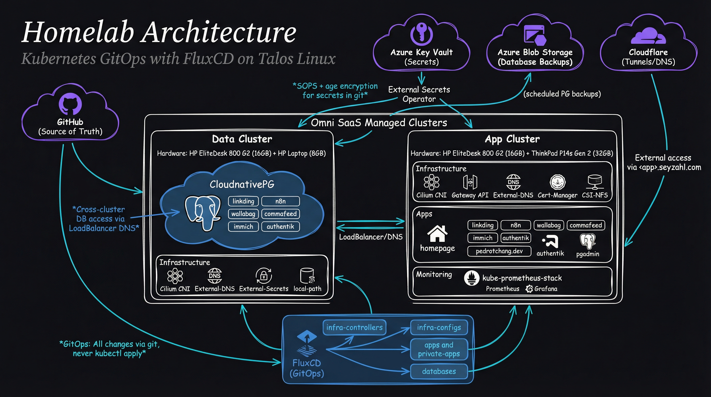
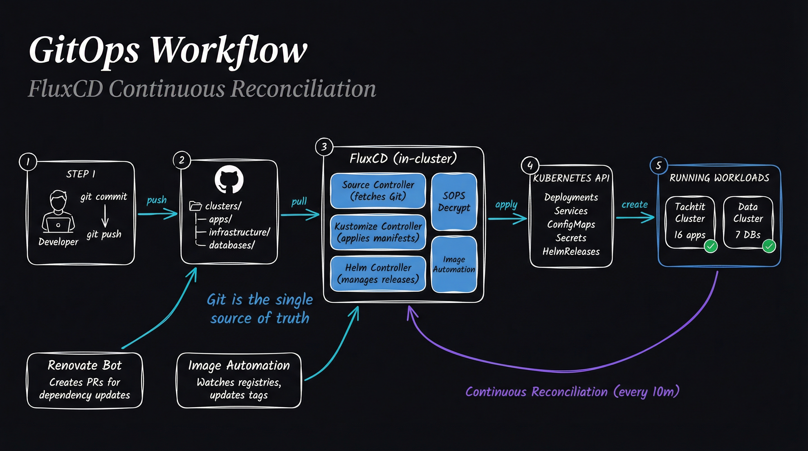

# Welcome to my Home(lab) 🏡

<https://www.pedrotchang.dev/>

## Introduction

Here you will find all the documentation of my homelab.

This repository is where I do all my testing, tinkering, and all-in-all a space for me to play, and work! It does have a serious note as well, since I will be working with my own personal data and require me to think about the whole process of deployment and maintanence!

## Architecture

### GitOps Workflow

## Hardware & Cluster Provisioning

I like to start off talking about hardware first. It's I think a great base line to understand what I was working with.

I have currently 3 old hardware:\
HP EliteDesk 800 G2 i5-6500T/16GB/256SSD\
HP EliteDesk 800 G2 i5-6500T/16GB/256SSD\
HP Laptop (atm do not know the model) 8GB/256SSD

I love [Talos Linux](https://www.talos.dev/). It has production grade security out of the box, is lightweight, and has robust features. At first, I used straight baremetal. But after sometime (a week...), I realized that [Omni](https://www.siderolabs.com/platform/saas-for-kubernetes/) was the way to go.

I could spin up new clusters in seconds, and exposing external services is a breeze.

I have them in this structure:

| Cluster | Usage | Hardware |
| --------------- | --------------- | --------------- |
| Data | PostgreSQL Database | HP Laptop |
| Tachtit | Apps | HP 800 G2 x 2 |

## Apps

| Icon | Name | Description |
|------|------|-------------|
|  | [Cilium](https://cilium.io/) | An amazing CNI used for all my clusters. I opt out of Flannel for Cilium. |
|  | [CloudnativePG](https://cloudnative-pg.io/) | A Kubernetes operator for deploying and managing PostgreSQL clusters. |
|  | [External Secrets Operator](https://external-secrets.io/) | A Kubernetes operator that synchronizes secrets from external APIs into Kubernetes. Currently, it uses secrets from my Azure Key Vault. |
|  | [External DNS](https://github.com/kubernetes-sigs/external-dns) | A Kubernetes addon that automates the management of DNS records based on Kubernetes resources. |
|  | [FluxCD](https://fluxcd.io/) | A GitOps tool for automating Kubernetes deployments from Git repositories. |
|  | [Flux Operator](https://github.com/flux-framework/flux-operator) | A Kubernetes CRD controller that manages the lifecycle of CNCF Flux. It automates installation, configuration, and upgrades of Flux controllers through a declarative API. |
|  | [Grafana](https://grafana.com/) | A multi-platform analytics and visualization web application for monitoring data. |
|  | [Prometheus](https://prometheus.io/) | An open-source monitoring and alerting toolkit for containers and microservices. |
|  | [Renovate](https://www.mend.io/renovate/) | An automated dependency update tool that creates and maintains pull requests for your dependencies. |
|  | [Authentik](https://goauthentik.io/) | An open-source identity and access management platform providing authentication, authorization, and single sign-on (SSO) capabilities. |
|  | [pgAdmin](https://www.pgadmin.org/) | A web-based administration and development platform for PostgreSQL databases. |

### End User Applications

#### Productivity & Knowledge Management
| Icon | Name | Description |
|------|------|-------------|
|  | [Homepage](https://gethomepage.dev/) | A self-hosted dashboard that allows you to organize your web services and bookmarks in a clean, customizable interface. |
|  | [Linkding](https://github.com/sissbruecker/linkding) | A self-hosted bookmark manager with tagging and search functionality. |
|  | [Wallabag](https://wallabag.org/) | A self-hosted read-it-later application that saves web articles and strips away clutter for comfortable reading. |
|  | [n8n](https://n8n.io/) | A self-hosted workflow automation tool that connects apps and services with a visual node-based editor. |
|  | [CommaFeed](https://www.commafeed.com/) | A self-hosted RSS reader inspired by Google Reader with a clean, responsive interface. |

#### Media & Content
| Icon | Name | Description |
|------|------|-------------|
|  | [Immich](https://immich.app/) | A high-performance self-hosted photo and video backup solution with features like automatic backup, timeline view, and ML-powered search. |
|  | [Audiobookshelf](https://www.audiobookshelf.org/) | A self-hosted audiobook and podcast server with mobile apps, progress tracking, and streaming capabilities. |

#### Lifestyle or Personal
| Icon | Name | Description |
|------|------|-------------|
|  | Minecraft | A Minecraft server for building and exploring with friends. |
|  | [Pedro T. Chang](https://pedrotchang.dev) | A Hugo-built blog for sharing thoughts and technical writing. |

## Next Steps

- [x] Link my PostgreSQL Database in the data cluster to my TrueNAS Scale.
- [x] Have blob storage for my data cluster to create periodic backups.
- [x] Add on Immich, CommaFeed, Wallabag, to work with my data cluster, and also backup to blob storage.

